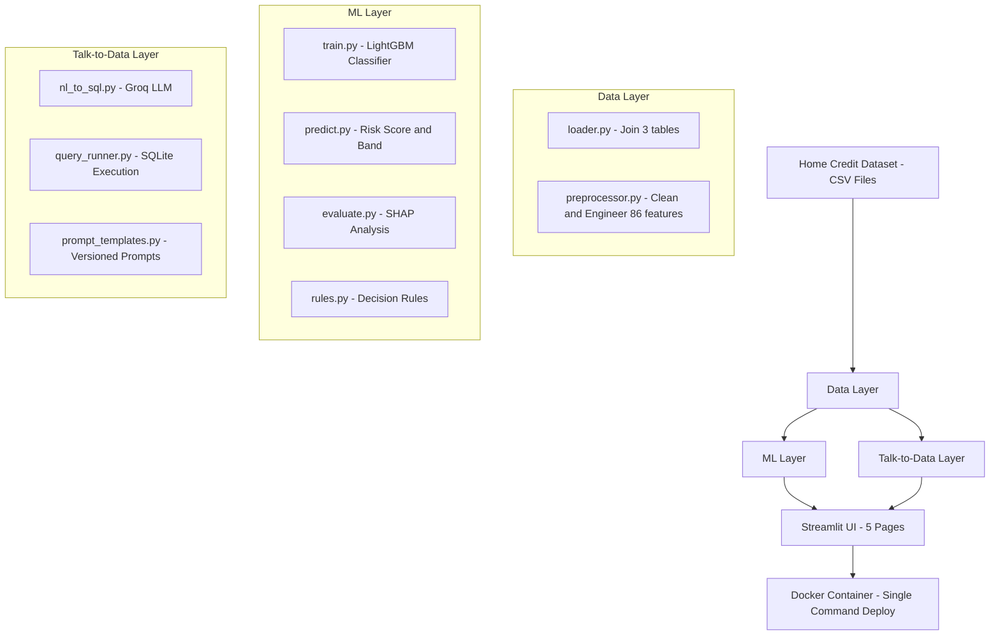
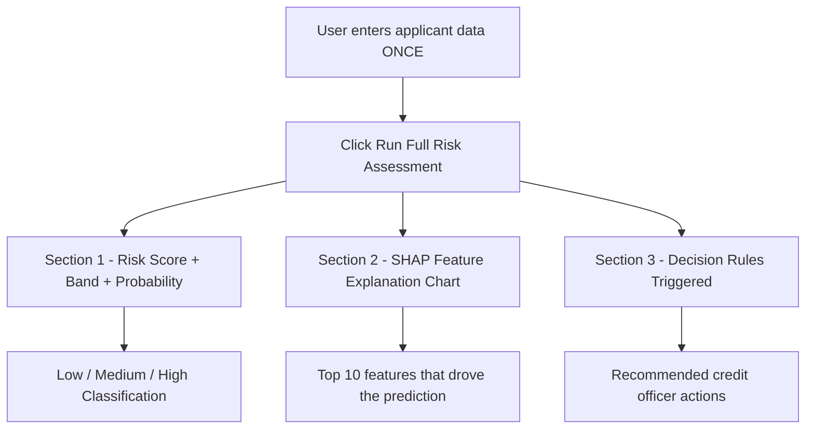
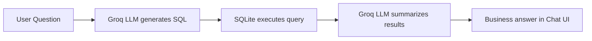
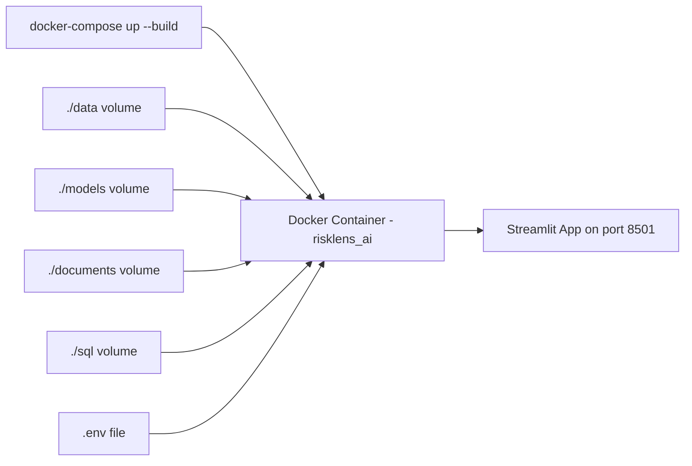

# RiskLens AI — Credit Risk Intelligence Platform

> AI-powered loan default prediction, explainability, and natural language data exploration built on the Home Credit Default Risk dataset.

---

## Table of Contents
- [Overview](#overview)
- [Architecture](#architecture)
- [Project Structure](#project-structure)
- [Setup and Installation](#setup-and-installation)
- [Running the App](#running-the-app)
- [Docker Deployment](#docker-deployment)
- [Module Breakdown](#module-breakdown)
- [Model Details](#model-details)
- [Prompt Engineering](#prompt-engineering)
- [Decision Rules](#decision-rules)
- [Known Limitations](#known-limitations)

---

## Overview

RiskLens AI is an end-to-end credit risk intelligence platform that helps banks make faster, more accurate, and explainable lending decisions. It combines machine learning, explainable AI, and a natural language chatbot into a single deployable web application.

**Key capabilities:**
- Predict loan default probability with a trained LightGBM model
- Explain every prediction using SHAP values
- Trigger business-readable decision rules — all in one unified Risk Assessment page
- Let analysts ask questions in plain English via a Groq and Llama powered chatbot
- Explore the dataset with interactive EDA charts
- One-command Docker deployment

---

## Architecture



---

### Risk Assessment Page Flow



---

### Talk-to-Data Pipeline



---

### Docker Architecture



---

### Tech Stack

| Component | Choice | Reason |
|---|---|---|
| ML Model | LightGBM | Fast, handles imbalance natively, excellent on tabular financial data |
| Explainability | SHAP TreeExplainer | Native LightGBM support, fast on large datasets |
| LLM | Groq Llama 3.3 70B | Free tier, extremely fast inference, accurate SQL generation |
| UI | Streamlit | Python-native, rapid development, clean widget system |
| Database | SQLite | Zero-config, file-based, perfect for NL to SQL pipeline |
| Deployment | Docker and Docker Compose | Single-command reproducible environment |

---

## Project Structure

```text
credit_risk_platform/
├── data/
│   ├── application_train.csv        # Main applicant data - 307,511 rows
│   ├── bureau.csv                   # Previous credits at other institutions
│   └── previous_application.csv    # Previous Home Credit applications
│
├── documents/
│   ├── eda_charts/                  # 6 EDA chart PNGs generated by eda.py
│   ├── shap_charts/                 # SHAP summary and bar charts
│   └── project_presentation.pdf    # Project presentation slides
│
├── models/
│   ├── lgbm_model.pkl               # Trained LightGBM model
│   ├── encoders.pkl                 # Label encoders for categorical columns
│   ├── feature_names.pkl            # Feature names used during training
│   ├── feature_importance.csv       # Feature importance scores
│   └── metrics.json                 # Evaluation metrics - ROC-AUC, F1 etc
│
├── notebooks/
│   ├── eda.ipynb                    # Exploratory Data Analysis notebook
│   └── eda.py                       # EDA script with full src imports
│
├── src/
│   ├── data/
│   │   ├── loader.py                # Load and join all dataset tables
│   │   └── preprocessor.py          # Clean, encode, impute, engineer features
│   │
│   ├── ml/
│   │   ├── train.py                 # Full model training pipeline
│   │   ├── predict.py               # Single applicant inference and scoring
│   │   ├── evaluate.py              # SHAP analysis and model evaluation
│   │   └── rules.py                 # Business decision rules derived from ML
│   │
│   ├── talk_to_data/
│   │   ├── nl_to_sql.py             # Groq LLM - converts question to SQL
│   │   ├── query_runner.py          # SQLite execution and full pipeline
│   │   └── prompt_templates.py      # Versioned prompt templates
│   │
│   └── utils/
│       ├── config.py                # Environment variables and constants
│       └── logger.py                # Logging setup
│
├── sql/
│   └── schema.sql                   # SQLite database schema documentation
│
├── ui/
│   ├── home.py                      # Overview page
│   ├── eda_page.py                  # EDA Dashboard
│   ├── prediction_page.py           # Risk Assessment - Score + SHAP + Rules combined
│   ├── chatbot_page.py              # Talk to Data chatbot
│   └── metrics_page.py              # Model metrics and evaluation
│
├── app.py                           # Streamlit entry point
├── Dockerfile                       # Docker image definition
├── docker-compose.yml               # Multi-container orchestration
├── requirements.txt                 # All Python dependencies
├── .env.example                     # Environment variable template
├── .gitignore                       # Git ignore rules
└── README.md                        # This file
```

---

## Setup and Installation

### Prerequisites
- Python 3.12 or higher
- Homebrew — Mac M1 and M2 only
- Kaggle account — to download the dataset
- Groq API key — free at [console.groq.com](https://console.groq.com)
- Docker Desktop — for containerized deployment

---

### Step 1 — Clone the repository

```bash
git clone <your-repo-url>
cd credit_risk_platform
```

### Step 2 — Install libomp — Mac M1 and M2 only

```bash
brew install libomp
```

### Step 3 — Create virtual environment

```bash
python3 -m venv venv
source venv/bin/activate
```

### Step 4 — Install dependencies

```bash
pip install -r requirements.txt
```

### Step 5 — Configure environment variables

```bash
cp .env.example .env
```

Open `.env` and paste your Groq API key:

```text
GROQ_API_KEY=your_actual_key_here
```

### Step 6 — Download the dataset

```bash
mkdir -p ~/.kaggle
mv ~/Downloads/kaggle.json ~/.kaggle/
chmod 600 ~/.kaggle/kaggle.json

cd data
kaggle competitions download -c home-credit-default-risk
unzip home-credit-default-risk.zip
cd ..
```

### Step 7 — Train the model

```bash
python3 src/ml/train.py
```

This takes approximately 5 minutes and saves the model to `models/`.

### Step 8 — Generate EDA charts and SHAP analysis

```bash
python3 notebooks/eda.py
python3 src/ml/evaluate.py
```

### Step 9 — Build the SQLite database

```bash
python3 -c "
from src.talk_to_data.query_runner import build_database
build_database()
"
```

---

## Running the App

```bash
source venv/bin/activate
streamlit run app.py
```

Open [http://localhost:8501](http://localhost:8501) in your browser.

---

## Docker Deployment

The evaluator can run the full platform with a single command. Complete Steps 7, 8, and 9 first to generate model artifacts and the database, then:

```bash
# Step 1 — Configure API key
cp .env.example .env
# Edit .env and set GROQ_API_KEY

# Step 2 — Build and launch
docker-compose up --build
```

Open [http://localhost:8501](http://localhost:8501).

To stop the container:

```bash
docker-compose down
```

> **Note:** The `data/`, `models/`, `documents/`, and `sql/` folders are mounted as Docker volumes. The container uses your pre-trained model and dataset directly — no retraining required inside Docker.

---

## Module Breakdown

### Module 1 — EDA Dashboard

Explores the raw dataset across 6 visualizations with business insights.

| Chart | Finding |
|---|---|
| Target Distribution | 91.9% non-default vs 8.1% default — 11:1 class imbalance |
| Default Rate by Age | Age 20-25 defaults at 12.3% vs 4.9% for age 60-70 |
| Income Distribution | Defaulters earn slightly less but distributions heavily overlap |
| Contract Type | Cash loans default at 8.3% vs 5.5% for revolving loans |
| Credit-Income Ratio | Defaulters show heavier right tail at high leverage ratios |
| Missing Values | Property columns have 60-70% missing — dropped at 45% threshold |

**Key business insights:**
- Overall default rate is 8.07%
- Applicants aged 20-25 are the highest risk cohort at 12.3%
- Low-skill laborers default at 17.15% — highest risk occupation
- Male applicants default at 10.1% vs 7.0% for female applicants
- EXT_SOURCE_2 and EXT_SOURCE_3 are the strongest predictors in the model

---

### Module 2 — Talk-to-Data Chatbot

Natural language to SQL pipeline powered by Groq and Llama 3.3 70B.

**5 verified working queries:**

| Query | Description |
|---|---|
| What is the overall default rate? | Aggregate default rate across all applicants |
| Which gender has a higher default rate? | Group by gender with default rate |
| Average income of defaulters vs non-defaulters? | Compare income by TARGET value |
| How many applicants have more than 3 previous loans? | Filter on bureau_loan_count |
| Top 5 occupations with highest default rate? | Group by occupation ordered by default rate |

---

### Module 3 — Risk Assessment Page

The core module — combines three outputs in one unified page so the user enters applicant data only once.

**Section 1 — Risk Score**

| Parameter | Value |
|---|---|
| Algorithm | LightGBM Classifier |
| Training samples | 246,008 |
| Test samples | 61,503 |
| Features | 86 engineered features |
| Imbalance strategy | scale_pos_weight = 11.39 |
| Output | Probability + Risk Score 0-100 + Band Low Medium High |

**Section 2 — SHAP Explanation**

- Method: SHAP TreeExplainer with native LightGBM support
- Shows top 10 features that drove this specific prediction
- Red bars increase risk, green bars decrease risk
- Includes detailed SHAP value table in expandable section

**Section 3 — Decision Rules Triggered**

- Evaluates all 10 credit policy rules against the applicant data
- Shows only the rules that fired for this specific applicant
- Each triggered rule shows rationale and recommended credit officer action
- If no rules fire, shows a green confirmation message

---

### Module 4 — Model Metrics

Full evaluation of the LightGBM model on the held-out test set.

| Metric | Score | Interpretation |
|---|---|---|
| ROC-AUC | 0.7665 | Primary metric for imbalanced binary classification |
| Avg Precision PR-AUC | 0.2568 | Better than ROC-AUC for severely imbalanced data |
| Recall default class | 0.6636 | Model catches 66% of actual defaulters |
| F1 default class | 0.2820 | Harmonic mean of precision and recall |

---

### Module 5 — User Interface

5-page Streamlit application with professional dark fintech theme.

- **Fonts:** Syne for headings, DM Sans for body, JetBrains Mono for code
- **Colors:** Dark navy background with blue, purple, green, and red accents
- **Pages:** Overview, EDA Dashboard, Risk Assessment, Talk to Data, Model Metrics

---

## Model Details

### Why LightGBM?

- Gradient boosting is the industry standard for tabular credit scoring
- Native scale_pos_weight parameter handles class imbalance cleanly
- Trains 246K samples in under 10 seconds on CPU
- SHAP TreeExplainer has native support — explanations are fast and exact
- Widely deployed in real-world banking credit scoring systems

### Class Imbalance Strategy

The dataset has an 11.39:1 ratio of non-defaulters to defaulters.

We use scale_pos_weight = 11.39 which penalizes misclassifying defaulters 11.39x more than non-defaulters. This was chosen over SMOTE because:

- Preserves the original data distribution with no synthetic samples
- Significantly faster with no resampling step on 246K rows
- Works natively inside LightGBM without an extra pipeline step
- Avoids overfitting to synthetic minority class samples

### Evaluation Results

| Metric | Score | Interpretation |
|---|---|---|
| ROC-AUC | 0.7665 | Primary metric for imbalanced binary classification |
| Avg Precision PR-AUC | 0.2568 | Better than ROC-AUC for severely imbalanced data |
| Recall default class | 0.6636 | Model catches 66% of actual defaulters |
| F1 default class | 0.2820 | Harmonic mean of precision and recall |

ROC-AUC of 0.7665 is competitive for this dataset. The Kaggle leaderboard top score is approximately 0.80 using all 8 dataset tables with extensive feature engineering. We used 3 tables.

---

## Prompt Engineering

### NL to SQL Prompt — temperature = 0

- Full table schema with column names, types, and descriptions provided upfront
- Model instructed to return raw SQL only — no markdown, no explanation
- SQLite-specific syntax enforced — ROUND, AVG, GROUP BY patterns
- Example patterns embedded — ROUND AVG TARGET times 100 AS default_rate
- LIMIT 100 enforced on all non-aggregate queries to prevent runaway results

### Answer Summary Prompt — temperature = 0.3

- Question plus SQL plus raw results all provided as context to the model
- Model instructed to respond in 2 to 3 sentences of plain business English
- Explicitly told to not mention SQL, tables, or any technical terms
- Slight temperature increase allows natural language variation in responses

### Hallucination Control

- SQL always executes against real data — LLM never answers from its own memory
- Column names are explicitly listed in the schema prompt — prevents model inventing columns
- Results are passed directly to the summary prompt — all answers are grounded in real data
- Invalid SQL is caught by try and except and returns a clean user-facing error message

---

## Decision Rules

Rules are derived from three sources:

1. **EDA findings** — age group default rates, occupation analysis, gender breakdown
2. **SHAP feature importance** — top model features become rule thresholds
3. **Banking domain knowledge** — standard credit policy leverage thresholds

Rules are shown inside the Risk Assessment page and trigger automatically based on applicant input. They are designed to satisfy regulatory explainability requirements such as Basel III and GDPR Article 22.

| ID | Condition | Risk Level | Action |
|---|---|---|---|
| R01 | Age less than 25 years | High | Require co-signer or collateral |
| R02 | EXT_SOURCE_2 below 0.3 AND EXT_SOURCE_3 below 0.3 | High | Reject or escalate |
| R03 | Credit greater than 5x annual income | High | Reduce credit or reject |
| R04 | Occupation in low-skill laborers or drivers | High | Stricter income verification |
| R05 | 2 or more previous refusals | High | Reject unless compensating factors |
| R06 | Credit between 3x and 5x income | Medium | Manual review required |
| R07 | Cash loan contract type | Medium | Standard due diligence |
| R08 | Employed less than 1 year | Medium | Request employment verification |
| R09 | EXT_SOURCE both above 0.6 AND age above 35 | Low | Approve standard terms |
| R10 | Credit below 1.5x income AND employed over 3 years | Low | Approve at preferred rate |

---

## Known Limitations and Possible Improvements

### Current Limitations

- Only 3 of 8 available dataset tables are used. Including installments payments, POS cash balance, and credit card balance would improve model performance significantly.
- The model is trained on historical data from one institution and may not generalize to other banks without retraining.
- SHAP is computed on 300 samples for speed. A larger sample would give more stable global importance values.
- The NL to SQL chatbot is limited to the 22 columns in the applicants table. Questions about raw bureau or installment data are not supported.

### Possible Improvements

- Include all 8 dataset tables in the feature engineering pipeline — expected ROC-AUC improvement to 0.78 or higher
- Optimize the classification threshold beyond the default 0.5 using a precision-recall curve
- Add MLflow experiment tracking for model versioning and reproducibility
- Expand the SQLite database to include bureau and installment tables for richer chatbot queries
- Add a downloadable PDF risk report per applicant
- Replace hand-crafted rules with a learned rule extraction method such as the RIPPER algorithm